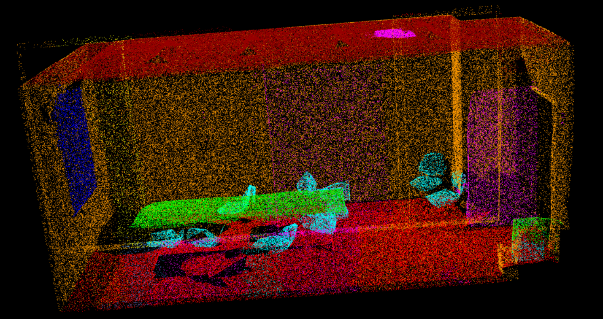
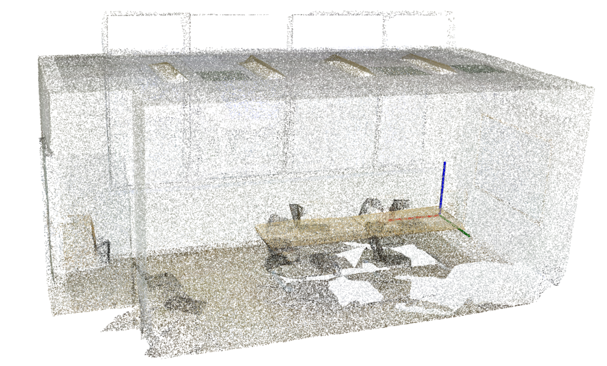

## JSIS3D 论文学习记录

论文地址：

- https://gitee.com/FanrenCLI/jsis3d
- https://github.com/pqhieu/jsis3d
  
## 环境准备
- CUDA 10
- Python 3.5+
- Pytorch 0.4.0+

### Installation
首先需要编译`MV-CRF`,在下载的文件根目录中运行一下命令：
```sh
    cd external/densecrf
    mkdir build
    cd build
    cmake -D CMAKE_BUILD_TYPE=Release ..
    make
    cd ../../.. # You should be at the root folder here
    make
```


### Dataset
1. 如果想自己准备数据集：
- 数据集准备，JSIS3D论文使用的是开源的[S3DIS](http://buildingparser.stanford.edu/dataset.html)数据集，所以需要下载`S3DIS`数据集,这个数据集下载之后大约4个G，解压之后16G。
- 在`data/s3dis`文件夹下创建`raw`和`processed`两个空文件夹用于存放原始数据和处理的过程数据
- 创建完`raw`和`processed`两个空文件夹之后，将我们下载的`S3DIS`数据集解压之后放入`raw`文件夹下
- 进入根目录下的`script`文件夹中，里面包含四个`py`文件，先运行`collect_annotations.py`文件，之后再运行`prepare_h5.py`
- 运行`prepare_h5.py`文件时，首先需要修改文件中`91`行的代码，将其中`num_points`改成`4096`,这是根据`pointnet`作者代码设置的参数进行设置的
- 运行完`prepare_h5.py`文件之后，接着运行`estimate_mean_size.py`和`estimate_median_freq.py`文件，数据集这样就制作完毕了。
2. 如果想使用作者提供的数据集：
- 作者提供了已经处理好的`S3DIS`数据集，[文件地址](https://drive.google.com/open?id=1s1cFfb8cInM-SNHQoTGxN9BIyNpNQK6x)
- 下载了作者的数据集之后，将解压后的数据集放入`data/s3dis/h5`即可


### Training & Evaluation

准备数据集之后，开始训练数据：
```sh
    python train.py --config configs/s3dis.json --logdir logs/s3dis
```
数据训练完成之后，模型相关的数据将会放在`logs/s3dis`文件夹下。

运行训练完的模型进行预测：
```sh
    python pred.py --logdir logs/s3dis --mvcrf
```

预测代码运行之后，会在`logs/s3dis`文件夹下生成`pred.npz`文件，之后想要对预测的结果进行可视化以及评价精度，运行以下代码：
```sh
    python eval.py --logdir logs/s3dis --visualize
```
运行完以上代码之后，将会在`logs/s3dis`文件夹中，生成ply文件，运用相关程序打开ply文件可以，发现里面有各个点运行的class和label信息。本文结合`open3d`和`plyfile`两个python库，对ply文件进行了处理与可视化，代码如下：
```python
    import open3d as o3d
    import numpy as np
    from plyfile import PlyData, PlyElement
    plydata = PlyData.read(
        r'F:\python_work\open3d_work\Area_5_conferenceRoom_1.ply')
    pc = plydata['vertex'].data
    pcd_array = []
    for i in range(pc.size):
        pcd_array.append(list(pc[i]))
    pcd_array = np.array(pcd_array)
    colors=pcd_array[:, 3:6]
    class_label = pcd_array[:, 6]
    t=class_label.tolist()
    s=set(t)
    class_label_pro = list(s)
    colors_list=[[152, 0, 0],[255, 0, 0],[255, 153, 0],[255, 255, 0],[0, 255, 0],[0, 255, 255],[74, 134, 232],[0, 0, 255],[255, 0, 255],[230, 184, 175],[252, 229, 205],[208, 224, 227],[221, 126, 107]]
    for i in range(class_label.size):
        colors[i]=colors_list[class_label_pro.index(class_label[i])]
    pointcloud = o3d.geometry.PointCloud()
    pointcloud.points = o3d.utility.Vector3dVector(pcd_array[:, 0:3])
    pointcloud.colors = o3d.utility.Vector3dVector(colors/255)
    o3d.io.write_point_cloud("copy_of_fragment.pcd", pointcloud)
    o3d.visualization.draw_geometries([pointcloud])
    print('ok')
```
针对以上代码可以在理解的基础上进行修改。结果图展示：




> **注意**:论文中针对S3DIS数据集，以区域1,2,3,4,6作为训练集，区域5作为测试集 

